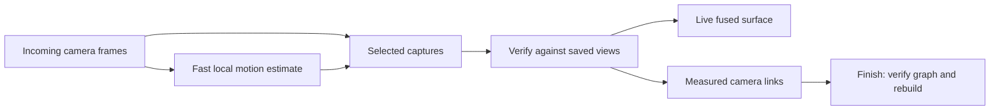

# Continuous visual tracking trial

Enable **Live fused point cloud feedback** and **Color-assisted tracking**, then
start a new scan. The camera worker now estimates motion on incoming camera
pairs while the server processes selected captures. Capture pacing and the
bounded upload queue remain in place. Restart the client and server to load the
changes; a running scan is not replaced by this development work.

## The two tracking speeds

The camera thread follows up to 500 image corners with pyramidal optical flow,
checks forward/backward agreement, and requires measured depth at both ends.
PnP proposes motion, paired 3D points constrain metric motion, and a small joint
pixel/depth refinement retains the feature identities. This is a short-baseline
motion estimate, not a trusted world map. Unknown depth is never filled. A gap
over 0.75 s, RGB/depth timing over 20 ms, insufficient distributed support, or
inconsistent motion breaks the chain and starts a new local coordinate system.
Camera restarts and session/calibration changes also start new chains. Visual
failure leaves acquisition running.

Selected uploads carry `metadata.visual_tracking`: a segment identifier,
camera-to-local transform, validity, steps, residuals, and timing. The server
can use relative motion only between rigid, bounded poses in the same segment.
It independently checks captured observations before fusion. A pose hint cannot
authorize a frame, bypass loss recovery, or join disconnected camera chains.
Intermediate camera images are not uploaded or saved, so exported sessions
retain motion summaries but cannot re-run the intermediate optical flow.

The server now attempts synchronized ORB/depth registration against the last
eight accepted views and four sampled historical views. Cache and search size
are bounded. A view can match an earlier measured keyframe during ordinary
tracking or recovery. ICP may refine the measured feature proposal, but the
result must still satisfy the original pixel and 3D correspondences. If geometry
slides off that evidence, the observed proposal is checked directly against
bidirectional raw depth instead. Distributed visual support can constrain a
textured plane; an anonymous or blank plane still cannot authorize motion.
The dense RGB-D fallback also rejects model refinements over 3 cm or 3° away
from its color seed. Ordinary geometric paths retain their existing gates.

Successful visual links are recorded immediately as `tracking_edges` and in
each frame's `visual_evidence`. This is online keyframe association, not online
global graph optimization. Full fragment graph optimization and fresh final
fusion still run at Finish. Model extraction follows its scheduled cadence
instead of being forced before every color-assisted frame.

The approach uses OpenCV's [pyramidal optical flow](https://docs.opencv.org/4.x/d4/dee/tutorial_optical_flow.html)
and [PnP](https://docs.opencv.org/4.x/d5/d1f/calib3d_solvePnP.html). The residual
scales and acceptance thresholds are engineering bounds, not a measured
per-device noise model. Repeated texture, moving subjects, occlusion, and
long-term drift remain limitations.

## Finish and the preview

The fragment pass now retains measured feature constraints during adjacent
registration. A planar fragment bridge can pass only when at least two distinct
camera positions on each side support the same transform with distributed
visual matches and independent held-out depth. Stationary duplicate images and
a single matching view remain insufficient. Optimized visual bridges must pass
both checks again before fresh fusion. Geometric bridges keep their existing
reciprocal and normal-diversity verification.

The combined revision also preserves measured neighboring-camera links across
the sixteen-view storage limit. A storage boundary no longer creates an
artificial tracking loss. If global optimization moves verified links beyond
their raw-data checks, its adjustment is rejected. The measured bridge poses
are rechecked, inconsistent surviving links are discarded, and connectivity
is recomputed from the first view. Pruned edges stay pruned. The report records
this fallback; it does not establish that accumulated drift has been corrected.

The live point cloud still includes low-weight tentative surface. Inspection
during capture uses weight 0.5; Finish uses the selected final confidence
threshold (2.0 in the chest archive), cleanup, and verified connectivity. The
panel now explains this persistently and reports how many captured views the
final model retains, including previously fused views excluded by verification.
No confidence or geometric gate was weakened simply to increase face count.

## Validation

A raycast sequence with noisy measured depth and known moving-camera poses tests
all intermediate camera frames while the server receives only the first and
last. The local motion estimate ends within 9 mm / 1.25° over an 11-step path;
the server independently verifies sparse fusion. Textured planar tests check
metric translation, rejection of an apparently perfect but sliding geometric
fit, earlier-keyframe recovery, and final fragment reconnection using two
independent visual/depth witnesses. Blank texture, inconsistent depth, timing
failure, invalid hints, stationary bridge evidence, and acquisition error
containment are also covered.

The Chest 3 replay uses the original 126 raw observations, calibration, timing
guards, and confidence settings. New live tracking accepted 104 captures versus
68 archived, with nine loss episodes versus fifteen. Eighty-two captures used
verified visual keyframe links, including six links to a view earlier than
the last accepted view. Median replay processing was 1.45 s versus 2.47 s recorded;
this is not a controlled throughput benchmark. More accepted views alone do
not establish absolute pose accuracy. The archive does not contain intermediate
camera frames, so it cannot validate the camera-rate path on the physical scan.

A compute-only test repeats the first archived native 1280 × 1024 pair with
artificial 10 fps timestamps: 18 measured motion updates take a median 43 ms
and at most 58 ms. This includes calibration, filtering, flow, and pose fitting;
it does not validate real acquisition throughput or physical moving-camera
accuracy. The full suite on the combined revision ran 283 tests (281 passed,
two CUDA skips), followed by 12 session-lifetime checks after the final client
reconnection change. The separate synthetic HTTP/WebSocket and Qt
capture/preview/Finish/export workflow passed.

Final replay outputs and complete raw-evidence reports are preserved outside Git
in `/Users/sasha/hobby/xbox360/chest-3-session-analysis/continuous-tracking/`.
The original archive is unchanged. A new physical capture with the running
client/server changes, and CUDA execution, remain unverified.

## Combined final replay result

The combined tracking and fragment-boundary fixes rebuild the archive with
**120 of 126 captured views**, compared with sixteen in the earlier final
replay. Nineteen rejected views are recovered, one hundred live poses corrected,
and three previously accepted views excluded. Missing captures are 38, 57, 81,
93, 104, and 121 (one based); the latter three were accepted during live replay.
All observations remain in the unchanged original ZIP.

| Final result | Earlier replay | Combined trial |
| --- | ---: | ---: |
| Retained views | 16 | 120 |
| Vertices | 52,722 | 200,081 |
| Triangles | 96,845 | 389,817 |
| Surface area | 0.826 m² | 3.315 m² |
| Final confidence threshold | 2.0 | 2.0 |
| Voxel size | 5 mm | 5 mm |

Thirteen fragments connect through twelve surviving measured bridges, including
three verified storage-boundary links. The search checks nineteen of sixty-four
candidate pairs. Global graph optimization passes its final raw-data checks;
the optimization fallback is not needed in this successful combined replay.
Additional pose refinement finds no further trustworthy loops. Fresh fragment
fusion uses 7,095 of the archive's 10,000-block budget and takes about 11.6 minutes
including verification. No separate finer voxel resolution was requested.

Matched oblique and overhead renders show a single chest with substantially
better lid and wall coverage. More captured floor also contributes to the
triangle increase; this is greater verified coverage, not a change in voxel
resolution or a measurement of absolute accuracy. The fixed-camera comparison
is `mesh-comparison.jpg`; the reconstructed mesh is `final.ply` in the artifact
directory above. The compact [benchmark record](benchmarks/chest-3-visual-tracking.json)
contains counts, exclusions, unchanged source checksum, and verification scope.
