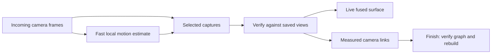

# Continuous visual tracking trial

Enable **Live fused point cloud feedback** and **Color-assisted tracking**, then
start a new scan. The camera worker now estimates motion on incoming camera
pairs while the server processes selected captures. Capture pacing and the
bounded upload queue remain in place. Restart the client and server to load the
changes; a running scan is not replaced by this development work.

## The two tracking speeds



The camera thread follows up to 500 image corners with persistent identities and pyramidal optical flow,
checks forward/backward agreement, and requires measured depth at both ends.
PnP proposes motion, paired 3D points constrain metric motion, and a small joint
pixel/depth refinement retains the feature identities. This is a short-baseline
motion estimate, not a trusted world map. Unknown depth is never filled. It
tries up to five recent verified references, newest first. A blurred image,
insufficient support, inconsistent motion, or RGB/depth timing over 20 ms leaves
those references intact for the next image. A gap over 0.75 s since the last
verified reference starts a new local coordinate system. Camera restarts and
session/calibration changes also start new chains. Visual failure leaves
acquisition running.

Selected uploads carry `metadata.visual_tracking`: a segment identifier,
camera-to-local transform, validity, steps, residuals, and timing. The server
can use relative motion only between rigid, bounded poses in the same segment.
It independently checks captured observations before fusion. A pose hint cannot
authorize a frame, bypass loss recovery, or join disconnected camera chains.
Intermediate camera images are not uploaded or saved, so exported sessions
retain motion summaries but cannot re-run the intermediate optical flow.

The server attempts synchronized ORB/depth registration against a bounded bank
of up to forty accepted views: the recent eight, the initial five, and up to
twenty-seven spaced historical landmarks. Descriptor matches rank the bank;
only the best five candidates undergo geometric registration. Stable landmarks
avoid rebuilding a uniformly resampled cache on every capture. A view can
match an earlier measured keyframe during ordinary
tracking or recovery. ICP may refine the measured feature proposal, but the
result must still satisfy the original pixel and 3D correspondences. If geometry
slides off that evidence, the observed proposal is checked directly against
bidirectional raw depth instead. Distributed visual support can constrain a
textured plane; an anonymous or blank plane still cannot authorize motion.
The dense RGB-D fallback also rejects model refinements over 3 cm or 3° away
from its color seed. Ordinary geometric paths retain their existing gates.

Successful visual links are recorded immediately as `tracking_edges` and in
each frame's `visual_evidence`. This is online keyframe association, not online
global graph optimization. Full fragment graph optimization and fresh final
fusion still run at Finish. Model extraction follows its scheduled cadence
instead of being forced before every color-assisted frame.

Recovery also checks up to five recent accepted raw depth observations instead
of depending on the last one alone. Wider appearance relocalization and Finish
use scale-tolerant SIFT features; ordinary live matching keeps the cheaper ORB
features. Descriptor similarity proposes a connection, which still needs the
existing measured color/depth and reciprocal geometry checks.

## Capture flow diagnostics

Open **Tracking diagnostics** in the Scan sidebar and enable **Show tracking
flow**. This preference defaults off, is saved locally, and can be toggled
during capture. The scan must have **Show live reconstruction** and
**Color-assisted tracking** enabled. The diagnostic preview uses the actual
calibrated RGB image on the 640 × 480 depth grid; native RGB has a different
resolution, lens model, and parallax, so scaling these coordinates onto it
would misplace the arrows. Color and Scan views show the overlay; the Depth
view keeps its depth display.

Arrows run from the reference location to the current image location. Green
marks correspondences consistent with verified camera motion; cyan marks
newly added corners. Red crosses mark failed optical
flow, orange marks forward/backward disagreement, purple marks unavailable or
unstable measured depth, and yellow marks geometry/pose rejection. A seeded
reference explicitly says that no motion has been measured yet. This local
verification still does not authorize server fusion.

The status shows the rejection counts, detected corner count, camera tracking
time, and reference age. The reference may be an earlier good image from the
five-view history, so arrows are not necessarily adjacent-frame motion. When
all attempts fail, the overlay describes the last attempted eligible reference.
Timing failures clear the overlay and display the failure reason.
**Show LK patch windows** outlines up to 24 evenly sampled feature windows to
keep the display readable. These are 21 × 21 pixel windows at pyramid level
zero, not a fixed search boundary.

The field retains up to 500 corners with persistent IDs, birth timestamps, and
successful observation counts. Verified survivors keep their subpixel locations
and measured depth in each new reference. The five-reference fallback can
recover those same identities from an earlier good image. Failed observations
within a current chain never replace the field, allocate IDs, or trigger
replenishment. A chain reset
starts fresh lifetimes; IDs are local to their segment, not world landmarks.

Replenishment runs after a verified motion step when fewer than 400 reliable
tracks remain, or an eligible cell in the 8 × 6 image grid has fewer than three
tracks. It keeps existing survivors, masks at least nine pixels around
them, and selects new measured-depth corners from the least populated cells
first, within the 500-track budget. Cells with insufficient included depth are
excluded from coverage checks. The detector can inspect up to 2,000 candidates
with corner quality 0.015 and nine-pixel spacing, but retains at most 500 tracks.
Healthy fields skip detection. Ordinary top-ups are spaced by at least 200 ms;
fewer than 60 surviving tracks bypass that delay. A new origin requires at
least 60 corners with stable measured depth. An unusable replacement reference
is discarded while earlier references remain available.

Maintaining an identity uses a stricter quality check than authorizing one
short motion step: retained tracks must have pixel residual at most 0.5 pixels
and paired 3D residual at most 20 mm. Tracks with weaker evidence are retired
and can be replaced. This limits accumulation of uncertain subpixel locations.
These are engineering bounds, not a calibrated sensor uncertainty model. The
existing motion acceptance, forward/backward, depth, and server verification
gates remain in effect. Lucas–Kanade still uses 21 × 21 windows at pyramid
levels 0–3. No camera image history beyond the five-reference bank is added.

Diagnostics show tracks kept/new/retired for quality, median/oldest track age,
grid coverage, and why replenishment ran or was skipped. Only newly added
corners are cyan. Green flow can support the current pose yet fail the stricter
lifetime check, so the green count can exceed the retained count. On a failed
frame, ages and active counts describe the last retained reference. Scalar
field summaries are included in capture metadata; per-feature IDs and ages
remain local preview data. Algorithm parameters currently use code defaults;
the sidebar controls visualization.

Debug arrays and the calibrated preview travel only with their matching
camera pair to the UI and are removed before manual/automatic capture
selection, upload, or recording. Drawing works on a copy. Toggling diagnostics
does not reset the motion chain, change acceptance thresholds, or restart the
camera. The cost of snapshot collection and overlay drawing applies only
while diagnostics are enabled. Physical Kinect capture with this overlay
still requires validation.

The adaptive-field tests cover identity survival across twelve updates,
count/coverage top-ups, minimum spacing, bounded detection cadence, quality
retirement, older-reference recovery, timing/depth/blank-frame rejection,
segment resets, and manual/automatic capture isolation. The existing noisy
raycast sequence still passes its metric motion checks: 9.31 mm translation
RMS, 8.95 mm final translation error, and 1.20° final rotation error over
twelve observations. Repeating with five PnP random seeds gives the same result.
This tests a synthetic camera sequence, not physical scanning accuracy.

The interleaved [compute benchmark](benchmarks/adaptive-feature-tracking.json)
compares thirty-frame textured-plane sequences over three repeats. Whole-update
median time changes from 9.83 to 7.42 ms, and from 9.21 to 7.92 ms with 20%
depth holes. Both versions accept all thirty observations; the feature support
sets differ by design. Synthetic translation RMS stays below 0.05 mm and maximum
rotation error below 0.006° on those idealized planes. These times exclude
acquisition, upload, server processing, and drawing; they do not establish
Kinect throughput or real-world pose accuracy.

## Adaptive tracking on archived captures

The [archived evaluation](benchmarks/archived-adaptive-feature-tracking.json)
compares the adaptive camera tracker with its immediate predecessor, `fdf144b`,
using every raw RGB/depth pair in four unchanged session ZIPs: 540 captures.
Calibration and depth filtering are held constant, and saved poses never
initialize either tracker. Two complete runs agree on motion counts, detector
calls, feature-count distributions, and input checksums. Timing below comes
from the second run on the same ARM Mac with four OpenCV threads, after warmup;
no validation tests ran concurrently with that run.

These archives contain selected captures, with gaps of 0.97–57.92 seconds,
and no intermediate camera streams. Every gap exceeds the camera tracker's
0.75-second reference lifetime. Replay with original timestamps produces
**zero measured motion steps in either version**. Bootstrap references are
counted separately and do not establish motion. The first two sessions also
have excessive RGB/depth skew: 45 of 50 and 183 of 200 captures exceed 20 ms.
All 126 Chest 3 and 164 Chest 4 pairs satisfy the timing guard. None of these
results measure a change in server pose verification or reconstruction quality.

A separate stationary diagnostic repeats each original raw pair for a seed
and five subsequent observations, with artificial 10 Hz timestamps and zero
skew. It preserves the recorded images, calibration and depth processing.
These are identical-image comparisons; they contain no real camera motion,
occlusion, blur, exposure changes or newly sampled sensor noise.

| Session | Raw captures | Median initial measured features, before → after | Median stationary motion update, before → after |
| --- | ---: | ---: | ---: |
| Chest, Oct 5 | 50 | 397.5 → 500 | 17.54 → 16.35 ms |
| Chest 2, Oct 6 | 200 | 427 → 500 | 17.58 → 16.26 ms |
| Chest 3, Oct 6 | 126 | 439 → 500 | 17.58 → 16.22 ms |
| Chest 4, Oct 7 | 164 | 316.5 → 317 | 16.98 → 16.04 ms |

Both versions verify all 2,700 stationary motion steps. Every original adaptive
feature identity survives its five updates, reaching 0.5 seconds of diagnostic
age; the predecessor selects a fresh field every time. Corner-detector calls
fall from 3,240 to 1,124, a **65.3% reduction** including initialization. The
combined median motion-update time falls from 17.44 to 16.23 ms, **6.9% lower**.
The 90th percentile increases slightly, from 18.25 to 18.55 ms; replenishment
still costs work. Median new-reference seeding increases from 13.78 to 14.40 ms.
Static translation drift stays below 0.001 mm in both versions. That measures
numerical consistency on duplicated observations, not Kinect accuracy.

Chest 4 also stores 164 capture-selected live reports from the tracker used
during that earlier scan: 159 have measured support, five report chain loss,
and 27 distinct local segments appear. Median supported feature count is 279,
median reported pixel residual is 0.336 px, and median reported depth residual
is 1.71 mm. These are fitting residuals and sampled old-tracker diagnostics,
not independent pose truth or an evaluation of adaptive lifetimes.

Reproduce the selected-capture evaluation with:

```sh
OMP_NUM_THREADS=4 python scripts/evaluate_archived_visual_tracking.py \
  export/sessions/*.zip --baseline-revision fdf144b --stationary-steps 5 \
  --threads 4 --output benchmark-output/archived-tracking.json \
  --details-output benchmark-output/archived-tracking.jsonl
```

The evaluator reads selected captures even if a newer archive includes sensor
streams. To measure moving-camera acceptance, recovery and feature lifetimes,
make a short new scan with **Record all camera frames (large files)** enabled
and replay its complete stream. The four evaluated archives cannot supply
that missing evidence.

## Sharp capture selection and recovery pacing

Automatic capture chooses from the last five incoming RGB-D pairs, limited to
300 ms of age and captured after the preceding upload. It prefers a valid
camera motion estimate, then the highest grayscale Laplacian variance at a
fixed scoring resolution, with the newest image breaking ties. RGB, measured
depth, timestamps and motion metadata always come from the same candidate.
This is a relative sharpness score, not a guarantee that the selected image is
sharp. Manual capture continues to send the displayed latest image.

While fusion is paused, automatic capture checks each arriving image and sends
the next fresh selected pair as soon as the previous recovery check finishes,
with a 100 ms minimum spacing. It bypasses the ordinary capture interval and
learned processing delay, but allows only one outstanding recovery probe.
Unused candidates are discarded; frames actually sent to the server remain in
the session for later verification. Successful recovery resumes normal pacing.

The approach uses OpenCV's [pyramidal optical flow](https://docs.opencv.org/4.x/d4/dee/tutorial_optical_flow.html)
and [PnP](https://docs.opencv.org/4.x/d5/d1f/calib3d_solvePnP.html). The residual
scales and acceptance thresholds are engineering bounds, not a measured
per-device noise model. Repeated texture, moving subjects, occlusion, and
long-term drift remain limitations.

## Finish and the preview

The fragment pass now retains measured feature constraints during adjacent
registration. It tries the previous five prepared views, so a bad capture need
not split the next good view from an earlier reference. Nonadjacent local links
allow the same per-capture motion budget over at most three capture steps; the
reciprocal, visual and held-out depth checks are unchanged. Fragments retain
their first five, last five and middle views as retrieval witnesses, plus
measured boundary context, to preserve short overlap arcs. A planar fragment
bridge can pass only when at least two distinct
camera positions on each side support the same transform with distributed
visual matches and independent held-out depth. Stationary duplicate images and
a single matching view remain insufficient. Optimized visual bridges must pass
both checks again before fresh fusion. Geometric bridges keep their existing
reciprocal and normal-diversity verification.

The combined revision also preserves measured neighboring-camera links across
the sixteen-view storage limit. A storage boundary no longer creates an
artificial tracking loss. If global optimization moves verified links beyond
their raw-data checks, its adjustment is rejected. The measured bridge poses
are rechecked, inconsistent surviving links are discarded, and connectivity
is recomputed from the first view. Pruned edges stay pruned. The report records
this fallback; it does not establish that accumulated drift has been corrected.
The report counts independent cycles in the surviving verified fragment graph,
after pruning and fallback. The final guidance displays that count together
with any applied refinement loops. A redundant edge that becomes the only
remaining connection does not count as a closed loop.

The live point cloud still includes low-weight tentative surface. Inspection
during capture uses weight 0.5; Finish uses the selected final confidence
threshold (2.0 in the chest archive), cleanup, and verified connectivity. The
panel now explains this persistently and reports how many captured views the
final model retains, including previously fused views excluded by verification.
No confidence or geometric gate was weakened simply to increase face count.

## Validation

A raycast sequence with noisy measured depth and known moving-camera poses tests
all intermediate camera frames while the server receives only the first and
last. The local motion estimate ends within 9 mm / 1.25° over an 11-step path;
the server independently verifies sparse fusion. Textured planar tests check
metric translation, rejection of an apparently perfect but sliding geometric
fit, earlier-keyframe recovery, and final fragment reconnection using two
independent visual/depth witnesses. Blank texture, inconsistent depth, timing
failure, invalid hints, stationary bridge evidence, and acquisition error
containment are also covered.

The Chest 3 replay uses the original 126 raw observations, calibration, timing
guards, and confidence settings. New live tracking accepted 104 captures versus
68 archived, with nine loss episodes versus fifteen. Eighty-two captures used
verified visual keyframe links, including six links to a view earlier than
the last accepted view. Median replay processing was 1.45 s versus 2.47 s recorded;
this is not a controlled throughput benchmark. More accepted views alone do
not establish absolute pose accuracy. The archive does not contain intermediate
camera frames, so it cannot validate the camera-rate path on the physical scan.

A compute-only test repeats the first archived native 1280 × 1024 pair with
artificial 10 fps timestamps: 18 measured motion updates take a median 43 ms
and at most 58 ms. This includes calibration, filtering, flow, and pose fitting;
it does not validate real acquisition throughput or physical moving-camera
accuracy. The full suite on the combined revision ran 283 tests (281 passed,
two CUDA skips), followed by 12 session-lifetime checks after the final client
reconnection change. The separate synthetic HTTP/WebSocket and Qt
capture/preview/Finish/export workflow passed.

Final replay outputs and complete raw-evidence reports are preserved outside Git
in `/Users/sasha/hobby/xbox360/chest-3-session-analysis/continuous-tracking/`.
The original archive is unchanged. A new physical capture with the running
client/server changes, and CUDA execution, remain unverified.

## Combined final replay result

The combined tracking and fragment-boundary fixes rebuild the archive with
**120 of 126 captured views**, compared with sixteen in the earlier final
replay. Nineteen rejected views are recovered, one hundred live poses corrected,
and three previously accepted views excluded. Missing captures are 38, 57, 81,
93, 104, and 121 (one based); the latter three were accepted during live replay.
All observations remain in the unchanged original ZIP.

| Final result | Earlier replay | Combined trial |
| --- | ---: | ---: |
| Retained views | 16 | 120 |
| Vertices | 52,722 | 200,081 |
| Triangles | 96,845 | 389,817 |
| Surface area | 0.826 m² | 3.315 m² |
| Final confidence threshold | 2.0 | 2.0 |
| Voxel size | 5 mm | 5 mm |

Thirteen fragments connect through twelve surviving measured bridges, including
three verified storage-boundary links. The search checks nineteen of sixty-four
candidate pairs. Global graph optimization passes its final raw-data checks;
the optimization fallback is not needed in this successful combined replay.
Additional pose refinement finds no further trustworthy loops. Fresh fragment
fusion uses 7,095 of the archive's 10,000-block budget and takes about 11.6 minutes
including verification. No separate finer voxel resolution was requested.

Matched oblique and overhead renders show a single chest with substantially
better lid and wall coverage. More captured floor also contributes to the
triangle increase; this is greater verified coverage, not a change in voxel
resolution or a measurement of absolute accuracy. The fixed-camera comparison
is `mesh-comparison.jpg`; the reconstructed mesh is `final.ply` in the artifact
directory above. The compact [benchmark record](benchmarks/chest-3-visual-tracking.json)
contains counts, exclusions, unchanged source checksum, and verification scope.

The later [Chest 4 recovery result](CHEST_4_TRACKING_RECOVERY.md) tests sharper
capture selection, recent-reference fallback and wider returning-loop retrieval
on the following scan.
