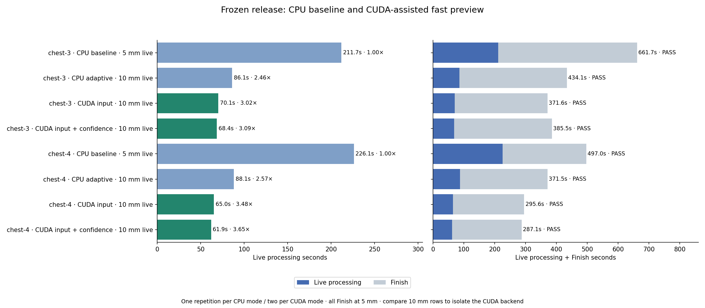
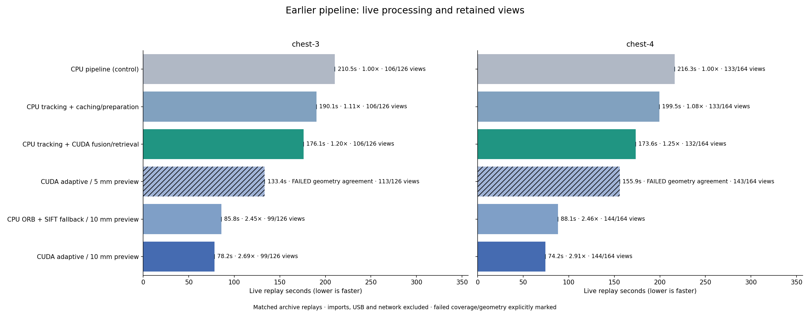
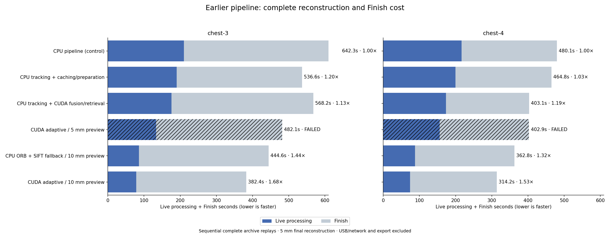
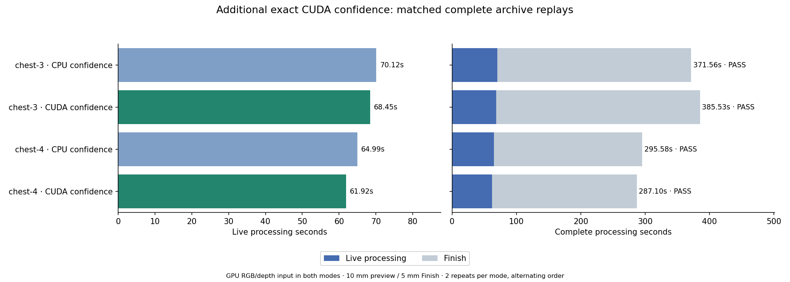

# CUDA pipeline experiments

Sequential isolated replays; all original views, calibrations and verification thresholds. Primary CPU/CUDA controls preserve 5 mm live/final fusion. Explicit adaptive preview tradeoff uses 10 mm live fusion and the same 5 mm final reconstruction/budget. Timing includes processing rejected views, but excludes imports, ZIP decoding, USB and network. Final agreement uses original coordinates without alignment; CPU reference is not independent ground truth. The primary matched-source matrix shares one source fingerprint and driver 610.88. The frozen release has its own same-source CPU baseline and alternating-order CUDA repetitions, with matching thread resources. Historical controls and the scripted adaptive prototype retain their separate provenance.

## Frozen release compared with the original CPU workflow

One repetition per CPU mode and two alternating-order repetitions per CUDA mode and archive, using the same tested source, driver and thread resources. The original CPU baseline uses 5 mm live fusion; all other rows use the same adaptive 10 mm preview policy. Every row Finishes at 5 mm with unchanged observations, memory budget and surface gates. Comparison with the original baseline measures combined workflow gains; comparison among 10 mm rows measures the additional CUDA backend benefit.

| Archive | Workflow | Repeats | Live median (range) | Finish median | Complete median (range) | Live capacity | Typical / p95 view | Final views | Surface p95 |
| --- | --- | ---: | ---: | ---: | ---: | ---: | ---: | ---: | ---: |
| chest-3 | CPU baseline · 5 mm live | 1 | 211.66s (211.66–211.66) | 450.06s | 661.73s (661.73–661.73) | 0.60 views/s | 1281 / 4925 ms | 121/126 | 0.160 mm |
| chest-3 | CPU adaptive · 10 mm live | 1 | 86.13s (86.13–86.13) | 348.01s | 434.14s (434.14–434.14) | 1.46 views/s | 328 / 2305 ms | 121/126 | 0.183 mm |
| chest-3 | CUDA input · 10 mm live | 2 | 70.12s (70.09–70.14) | 301.44s | 371.56s (365.55–377.57) | 1.80 views/s | 203 / 2019 ms | 121/126 | 0.188 mm |
| chest-3 | CUDA input + confidence · 10 mm live | 2 | 68.45s (67.75–69.15) | 317.08s | 385.53s (384.09–386.96) | 1.84 views/s | 172 / 1996 ms | 121/126 | 0.186 mm |
| chest-4 | CPU baseline · 5 mm live | 1 | 226.13s (226.13–226.13) | 270.84s | 496.97s (496.97–496.97) | 0.73 views/s | 969 / 3839 ms | 162/164 | 0.001 mm |
| chest-4 | CPU adaptive · 10 mm live | 1 | 88.07s (88.07–88.07) | 283.40s | 371.47s (371.47–371.47) | 1.86 views/s | 328 / 1826 ms | 162/164 | 0.002 mm |
| chest-4 | CUDA input · 10 mm live | 2 | 64.99s (64.87–65.11) | 230.59s | 295.58s (294.46–296.71) | 2.52 views/s | 172 / 1720 ms | 162/164 | 0.022 mm |
| chest-4 | CUDA input + confidence · 10 mm live | 2 | 61.92s (61.71–62.13) | 225.18s | 287.10s (281.65–292.55) | 2.65 views/s | 156 / 1659 ms | 162/164 | 0.021 mm |

| Archive | CUDA preparation | Matched CPU live time reduction | Matched CPU complete time reduction |
| --- | --- | ---: | ---: |
| chest-3 | input | 18.6% | 14.4% |
| chest-3 | input + confidence | 20.5% | 11.2% |
| chest-4 | input | 26.2% | 20.4% |
| chest-4 | input + confidence | 29.7% | 22.7% |

## Earlier matched-policy CUDA attribution

| Session | Mode | Live median (range) | Live speedup | Processing rate | Live retained | Typical / p95 frame | Finish | Complete | Surface p95 |
| --- | --- | ---: | ---: | ---: | ---: | ---: | ---: | ---: | ---: |
| chest-3 | CPU pipeline (control) | 210.5s (210.5–210.5) | 1.00× | 0.60 views/s | 106/126 | 1281 / 5003 ms | 431.8s | 642.3s | 0.159 mm |
| chest-3 | CPU tracking + caching/preparation | 190.1s (190.1–190.1) | 1.11× | 0.66 views/s | 106/126 | 750 / 5250 ms | 346.4s | 536.6s | 0.165 mm |
| chest-3 | CPU tracking + CUDA fusion/retrieval | 176.1s (176.1–176.1) | 1.20× | 0.72 views/s | 106/126 | 500 / 5437 ms | 392.1s | 568.2s | 0.000 mm |
| chest-3 | CUDA adaptive / 5 mm preview | 133.4s (133.4–133.4) | FAILED geometry agreement | 0.94 views/s | 113/126 | 453 / 4937 ms | 348.7s | 482.1s | 3.693 mm |
| chest-3 | CPU ORB + SIFT fallback / 10 mm preview | 85.8s (85.8–85.8) | 2.45× | 1.47 views/s | 99/126 | 320 / 2316 ms | 358.8s | 444.6s | 0.179 mm |
| chest-3 | CUDA adaptive / 10 mm preview | 78.2s (78.2–78.2) | 2.69× | 1.61 views/s | 99/126 | 250 / 2230 ms | 304.2s | 382.4s | 0.191 mm |
| chest-4 | CPU pipeline (control) | 216.3s (216.3–216.3) | 1.00× | 0.76 views/s | 133/164 | 985 / 3593 ms | 263.8s | 480.1s | 0.018 mm |
| chest-4 | CPU tracking + caching/preparation | 199.5s (199.5–199.5) | 1.08× | 0.82 views/s | 133/164 | 625 / 3721 ms | 265.3s | 464.8s | 0.000 mm |
| chest-4 | CPU tracking + CUDA fusion/retrieval | 173.6s (173.6–173.6) | 1.25× | 0.94 views/s | 132/164 | 422 / 3626 ms | 229.5s | 403.1s | 0.000 mm |
| chest-4 | CUDA adaptive / 5 mm preview | 155.9s (155.9–155.9) | FAILED geometry agreement | 1.05 views/s | 143/164 | 422 / 3608 ms | 247.0s | 402.9s | 3.259 mm |
| chest-4 | CPU ORB + SIFT fallback / 10 mm preview | 88.1s (88.1–88.1) | 2.46× | 1.86 views/s | 144/164 | 328 / 1842 ms | 274.7s | 362.8s | 0.003 mm |
| chest-4 | CUDA adaptive / 10 mm preview | 74.2s (74.2–74.2) | 2.91× | 2.21 views/s | 144/164 | 219 / 1772 ms | 240.0s | 314.2s | 0.022 mm |

## Matched native GPU input processing

Separate release-source comparison: the same CUDA adaptive 10 mm preview / 5 mm Finish, with GPU RGB/depth input preparation off or on. Confidence remains on CPU. Includes compatibility/setup work; excludes ZIP decoding and transport.

| Session | GPU input | Live | Finish | Complete | Live gain | Complete gain | Final surface gate |
| --- | --- | ---: | ---: | ---: | ---: | ---: | --- |
| chest-3 | off | 78.94s | 336.24s | 415.18s | 1.000× | 1.000× | PASS |
| chest-3 | on | 71.37s | 317.00s | 388.37s | 1.106× | 1.069× | PASS |
| chest-4 | off | 75.21s | 242.98s | 318.19s | 1.000× | 1.000× | PASS |
| chest-4 | on | 65.19s | 234.27s | 299.47s | 1.154× | 1.063× | PASS |

## Matched exact CUDA confidence

Separate matched-source comparison with GPU RGB/depth input enabled in both cases. Only the confidence processor changes; all raw observations, pose gates, fusion settings and CPU-reference surface gates remain fixed.

| Session | GPU confidence | Live | Finish | Complete | Live gain | Complete gain | Final surface gate |
| --- | --- | ---: | ---: | ---: | ---: | ---: | --- |
| chest-3 | off | 70.12s | 301.44s | 371.56s | 1.000× | 1.000× | PASS |
| chest-3 | on | 68.45s | 317.08s | 385.53s | 1.024× | 0.964× | PASS |
| chest-4 | off | 64.99s | 230.59s | 295.58s | 1.000× | 1.000× | PASS |
| chest-4 | on | 61.92s | 225.18s | 287.10s | 1.050× | 1.030× | PASS |

## Finish and reconstruction agreement

- chest-3 / cpu-baseline: Finish 431.8s; final 121/126 views; mesh success True.
- chest-3 / cpu-cached: Finish 346.4s; final 121/126 views; mesh success True.
- chest-3 / cpu-adaptive-preview-10mm: Finish 358.8s; final 121/126 views; mesh success True.
- chest-4 / cpu-baseline: Finish 263.8s; final 162/164 views; mesh success True.
- chest-4 / cpu-cached: Finish 265.3s; final 162/164 views; mesh success True.
- chest-4 / cpu-adaptive-preview-10mm: Finish 274.7s; final 162/164 views; mesh success True.
- chest-3 / legacy-cached: Finish 392.1s; final 121/126 views; mesh success True.
- chest-4 / legacy-cached: Finish 229.5s; final 162/164 views; mesh success True.
- chest-3 / baseline: Finish 349.7s; final 121/126 views; mesh success True.
- chest-3 / legacy-cached: Finish 319.3s; final 121/126 views; mesh success True.
- chest-4 / baseline: Finish 261.0s; final 162/164 views; mesh success True.
- chest-4 / legacy-cached: Finish 236.4s; final 162/164 views; mesh success True.
- chest-3 / baseline: Finish 329.5s; final 121/126 views; mesh success True.
- chest-3 / legacy-cached: Finish 320.0s; final 121/126 views; mesh success True.
- chest-3 / legacy-preview-10mm: Finish 297.7s; final 121/126 views; mesh success True.
- chest-4 / baseline: Finish 247.4s; final 162/164 views; mesh success True.
- chest-4 / legacy-cached: Finish 229.9s; final 162/164 views; mesh success True.
- chest-4 / legacy-preview-10mm: Finish 245.3s; final 162/164 views; mesh success True.
- chest-3 / legacy-sift: Finish 319.6s; final 121/126 views; mesh success True.
- chest-3 / legacy-sift-preview-10mm: Finish 331.4s; final 121/126 views; mesh success True.
- chest-4 / legacy-sift: Finish 229.5s; final 162/164 views; mesh success True.
- chest-4 / legacy-sift-preview-10mm: Finish 253.0s; final 162/164 views; mesh success True.
- chest-3 / legacy-adaptive-preview-10mm: Finish 333.7s; final 121/126 views; mesh success True.
- chest-4 / legacy-adaptive-preview-10mm: Finish 243.8s; final 162/164 views; mesh success True.
- chest-3 / legacy-adaptive-preview-10mm: Finish 304.2s; final 121/126 views; mesh success True.
- chest-4 / legacy-adaptive-preview-10mm: Finish 240.0s; final 162/164 views; mesh success True.
- chest-3 / legacy-adaptive: Finish 348.7s; final 121/126 views; mesh success True.
- chest-4 / legacy-adaptive: Finish 247.0s; final 162/164 views; mesh success True.
- chest-3 / orb-fine: Finish 433.6s; final 121/126 views; mesh success True.
- chest-3 / orb-fine-visual-final: Finish 331.2s; final 65/126 views; mesh success True.
- chest-4 / orb-fine: Finish 246.9s; final 162/164 views; mesh success True.
- chest-4 / orb-fine-visual-final: Finish 204.2s; final 79/164 views; mesh success True.
- chest-3 / baseline: Finish 439.3s; final 121/126 views; mesh success True.
- chest-3 / cached: Finish 370.8s; final 121/126 views; mesh success True.
- chest-3 / orb-fine: Finish 433.2s; final 121/126 views; mesh success True.
- chest-4 / baseline: Finish 258.9s; final 162/164 views; mesh success True.
- chest-4 / cached: Finish 237.8s; final 162/164 views; mesh success True.
- chest-4 / orb-fine: Finish 261.1s; final 162/164 views; mesh success True.
- chest-3 / sift-cpu: Finish 324.2s; final 121/126 views; mesh success True.
- chest-3 / measured-final: Finish 308.0s; final 122/126 views; mesh success True.
- chest-4 / sift-cpu: Finish 239.5s; final 162/164 views; mesh success True.
- chest-4 / measured-final: Finish 181.4s; final 46/164 views; mesh success True.
- chest-3 / sift: Finish 440.0s; final 121/126 views; mesh success True.
- chest-3 / sift-deferred: Finish 473.7s; final 121/126 views; mesh success True.
- chest-4 / sift: Finish 403.0s; final 162/164 views; mesh success True.
- chest-4 / sift-deferred: Finish 394.6s; final 162/164 views; mesh success True.
- chest-3 / legacy-adaptive-preview-10mm: Finish 336.2s; final 121/126 views; mesh success True.
- chest-3 / legacy-adaptive-preview-10mm-gpu-input: Finish 317.0s; final 121/126 views; mesh success True.
- chest-4 / legacy-adaptive-preview-10mm: Finish 243.0s; final 162/164 views; mesh success True.
- chest-4 / legacy-adaptive-preview-10mm-gpu-input: Finish 234.3s; final 162/164 views; mesh success True.
- chest-3 / legacy-adaptive-preview-10mm-gpu-input: Finish 295.4s; final 121/126 views; mesh success True.
- chest-3 / legacy-adaptive-preview-10mm-gpu-input-confidence: Finish 316.3s; final 121/126 views; mesh success True.
- chest-3 / legacy-adaptive-preview-10mm-gpu-input-confidence: Finish 317.8s; final 121/126 views; mesh success True.
- chest-3 / legacy-adaptive-preview-10mm-gpu-input: Finish 307.5s; final 121/126 views; mesh success True.
- chest-4 / legacy-adaptive-preview-10mm-gpu-input: Finish 229.6s; final 162/164 views; mesh success True.
- chest-4 / legacy-adaptive-preview-10mm-gpu-input-confidence: Finish 219.9s; final 162/164 views; mesh success True.
- chest-4 / legacy-adaptive-preview-10mm-gpu-input-confidence: Finish 230.4s; final 162/164 views; mesh success True.
- chest-4 / legacy-adaptive-preview-10mm-gpu-input: Finish 231.6s; final 162/164 views; mesh success True.
- chest-3 / cpu-baseline: Finish 450.1s; final 121/126 views; mesh success True.
- chest-3 / cpu-adaptive-preview-10mm: Finish 348.0s; final 121/126 views; mesh success True.
- chest-4 / cpu-baseline: Finish 270.8s; final 162/164 views; mesh success True.
- chest-4 / cpu-adaptive-preview-10mm: Finish 283.4s; final 162/164 views; mesh success True.
- finish\chest-3-scan-session_20261006_215208-sift-deferred-quality.json: same retained indices True; surface p95 5.957 mm; precision/completeness within 5 mm 92.633% / 93.227%. CPU reference is not independent ground truth.
- finish\chest-3-scan-session_20261006_215208-sift-quality.json: same retained indices True; surface p95 0.850 mm; precision/completeness within 5 mm 99.830% / 99.823%. CPU reference is not independent ground truth.
- finish\chest-4-scan-session_20261007_173028-sift-deferred-quality.json: same retained indices True; surface p95 9.041 mm; precision/completeness within 5 mm 86.527% / 86.980%. CPU reference is not independent ground truth.
- finish\chest-4-scan-session_20261007_173028-sift-quality.json: same retained indices True; surface p95 28.041 mm; precision/completeness within 5 mm 45.703% / 45.567%. CPU reference is not independent ground truth.
- phase2-finish\chest-3-scan-session_20261006_215208-measured-final-0-quality.json: same retained indices False; surface p95 7.388 mm; precision/completeness within 5 mm 77.633% / 78.453%. CPU reference is not independent ground truth.
- phase2-finish\chest-3-scan-session_20261006_215208-sift-cpu-0-quality.json: same retained indices True; surface p95 0.187 mm; precision/completeness within 5 mm 99.980% / 99.967%. CPU reference is not independent ground truth.
- phase2-finish\chest-4-scan-session_20261007_173028-measured-final-0-quality.json: same retained indices False; surface p95 44.355 mm; precision/completeness within 5 mm 19.923% / 9.287%. CPU reference is not independent ground truth.
- phase2-finish\chest-4-scan-session_20261007_173028-sift-cpu-0-quality.json: same retained indices True; surface p95 9.224 mm; precision/completeness within 5 mm 86.877% / 87.180%. CPU reference is not independent ground truth.
- phase3-finish\chest-3-scan-session_20261006_215208-baseline-0-quality.json: same retained indices True; surface p95 0.163 mm; precision/completeness within 5 mm 99.990% / 99.970%. CPU reference is not independent ground truth.
- phase3-finish\chest-3-scan-session_20261006_215208-cached-0-quality.json: same retained indices True; surface p95 39.656 mm; precision/completeness within 5 mm 85.000% / 89.817%. CPU reference is not independent ground truth.
- phase3-finish\chest-3-scan-session_20261006_215208-orb-fine-0-quality.json: same retained indices True; surface p95 0.160 mm; precision/completeness within 5 mm 99.987% / 99.970%. CPU reference is not independent ground truth.
- phase3-finish\chest-4-scan-session_20261007_173028-baseline-0-quality.json: same retained indices True; surface p95 0.000 mm; precision/completeness within 5 mm 100.000% / 100.000%. CPU reference is not independent ground truth.
- phase3-finish\chest-4-scan-session_20261007_173028-cached-0-quality.json: same retained indices True; surface p95 0.021 mm; precision/completeness within 5 mm 100.000% / 100.000%. CPU reference is not independent ground truth.
- phase3-finish\chest-4-scan-session_20261007_173028-orb-fine-0-quality.json: same retained indices True; surface p95 0.020 mm; precision/completeness within 5 mm 100.000% / 100.000%. CPU reference is not independent ground truth.
- phase4-finish\chest-3-scan-session_20261006_215208-orb-fine-0-quality.json: same retained indices True; surface p95 5.786 mm; precision/completeness within 5 mm 94.160% / 91.277%. CPU reference is not independent ground truth.
- phase4-finish\chest-3-scan-session_20261006_215208-orb-fine-visual-final-0-quality.json: same retained indices False; surface p95 10.486 mm; precision/completeness within 5 mm 62.437% / 47.483%. CPU reference is not independent ground truth.
- phase4-finish\chest-4-scan-session_20261007_173028-orb-fine-0-quality.json: same retained indices True; surface p95 0.002 mm; precision/completeness within 5 mm 100.000% / 100.000%. CPU reference is not independent ground truth.
- phase4-finish\chest-4-scan-session_20261007_173028-orb-fine-visual-final-0-quality.json: same retained indices False; surface p95 15.401 mm; precision/completeness within 5 mm 69.273% / 47.843%. CPU reference is not independent ground truth.
- legacy-finish\chest-3-scan-session_20261006_215208-baseline-0-quality.json: same retained indices True; surface p95 0.160 mm; precision/completeness within 5 mm 99.990% / 99.970%. CPU reference is not independent ground truth.
- legacy-finish\chest-3-scan-session_20261006_215208-legacy-cached-0-quality.json: same retained indices True; surface p95 0.000 mm; precision/completeness within 5 mm 100.000% / 100.000%. CPU reference is not independent ground truth.
- legacy-finish\chest-4-scan-session_20261007_173028-baseline-0-quality.json: same retained indices True; surface p95 0.000 mm; precision/completeness within 5 mm 100.000% / 100.000%. CPU reference is not independent ground truth.
- legacy-finish\chest-4-scan-session_20261007_173028-legacy-cached-0-quality.json: same retained indices True; surface p95 0.002 mm; precision/completeness within 5 mm 100.000% / 100.000%. CPU reference is not independent ground truth.
- legacy-repeat\chest-3-scan-session_20261006_215208-baseline-0-quality.json: same retained indices True; surface p95 0.000 mm; precision/completeness within 5 mm 100.000% / 100.000%. CPU reference is not independent ground truth.
- legacy-repeat\chest-3-scan-session_20261006_215208-legacy-cached-0-quality.json: same retained indices True; surface p95 0.160 mm; precision/completeness within 5 mm 99.990% / 99.970%. CPU reference is not independent ground truth.
- legacy-repeat\chest-3-scan-session_20261006_215208-legacy-preview-10mm-0-quality.json: same retained indices True; surface p95 0.083 mm; precision/completeness within 5 mm 100.000% / 99.997%. CPU reference is not independent ground truth.
- legacy-repeat\chest-4-scan-session_20261007_173028-baseline-0-quality.json: same retained indices True; surface p95 0.000 mm; precision/completeness within 5 mm 100.000% / 100.000%. CPU reference is not independent ground truth.
- legacy-repeat\chest-4-scan-session_20261007_173028-legacy-cached-0-quality.json: same retained indices True; surface p95 0.000 mm; precision/completeness within 5 mm 100.000% / 100.000%. CPU reference is not independent ground truth.
- legacy-repeat\chest-4-scan-session_20261007_173028-legacy-preview-10mm-0-quality.json: same retained indices True; surface p95 0.002 mm; precision/completeness within 5 mm 100.000% / 100.000%. CPU reference is not independent ground truth.
- legacy-sift\chest-3-scan-session_20261006_215208-legacy-sift-0-quality.json: same retained indices True; surface p95 0.188 mm; precision/completeness within 5 mm 99.997% / 99.967%. CPU reference is not independent ground truth.
- legacy-sift\chest-3-scan-session_20261006_215208-legacy-sift-preview-10mm-0-quality.json: same retained indices True; surface p95 0.188 mm; precision/completeness within 5 mm 99.997% / 99.967%. CPU reference is not independent ground truth.
- legacy-sift\chest-4-scan-session_20261007_173028-legacy-sift-0-quality.json: same retained indices True; surface p95 8.480 mm; precision/completeness within 5 mm 88.247% / 88.397%. CPU reference is not independent ground truth.
- legacy-sift\chest-4-scan-session_20261007_173028-legacy-sift-preview-10mm-0-quality.json: same retained indices True; surface p95 8.479 mm; precision/completeness within 5 mm 88.210% / 88.413%. CPU reference is not independent ground truth.
- adaptive-preview\chest-3-scan-session_20261006_215208-legacy-adaptive-preview-10mm-0-quality.json: same retained indices True; surface p95 0.184 mm; precision/completeness within 5 mm 99.990% / 99.967%. CPU reference is not independent ground truth.
- adaptive-preview\chest-4-scan-session_20261007_173028-legacy-adaptive-preview-10mm-0-quality.json: same retained indices True; surface p95 0.022 mm; precision/completeness within 5 mm 99.997% / 100.000%. CPU reference is not independent ground truth.
- adaptive-repeat\chest-3-scan-session_20261006_215208-legacy-adaptive-preview-10mm-0-quality.json: same retained indices True; surface p95 0.191 mm; precision/completeness within 5 mm 99.983% / 99.967%. CPU reference is not independent ground truth.
- adaptive-repeat\chest-4-scan-session_20261007_173028-legacy-adaptive-preview-10mm-0-quality.json: same retained indices True; surface p95 0.022 mm; precision/completeness within 5 mm 100.000% / 100.000%. CPU reference is not independent ground truth.
- adaptive-fine\chest-3-scan-session_20261006_215208-legacy-adaptive-0-quality.json: same retained indices True; surface p95 3.693 mm; precision/completeness within 5 mm 96.980% / 97.523%. CPU reference is not independent ground truth.
- adaptive-fine\chest-4-scan-session_20261007_173028-legacy-adaptive-0-quality.json: same retained indices True; surface p95 3.259 mm; precision/completeness within 5 mm 97.593% / 97.127%. CPU reference is not independent ground truth.
- production-control\chest-3-scan-session_20261006_215208-legacy-cached-0-quality.json: same retained indices True; surface p95 0.000 mm; precision/completeness within 5 mm 100.000% / 100.000%. CPU reference is not independent ground truth.
- production-control\chest-4-scan-session_20261007_173028-legacy-cached-0-quality.json: same retained indices True; surface p95 0.000 mm; precision/completeness within 5 mm 100.000% / 100.000%. CPU reference is not independent ground truth.
- cpu-control\chest-3-scan-session_20261006_215208-cpu-adaptive-preview-10mm-0-quality.json: same retained indices True; surface p95 0.179 mm; precision/completeness within 5 mm 99.997% / 99.967%. CPU reference is not independent ground truth.
- cpu-control\chest-3-scan-session_20261006_215208-cpu-baseline-0-quality.json: same retained indices True; surface p95 0.159 mm; precision/completeness within 5 mm 99.997% / 99.970%. CPU reference is not independent ground truth.
- cpu-control\chest-3-scan-session_20261006_215208-cpu-cached-0-quality.json: same retained indices True; surface p95 0.165 mm; precision/completeness within 5 mm 99.993% / 99.970%. CPU reference is not independent ground truth.
- cpu-control\chest-4-scan-session_20261007_173028-cpu-adaptive-preview-10mm-0-quality.json: same retained indices True; surface p95 0.003 mm; precision/completeness within 5 mm 100.000% / 100.000%. CPU reference is not independent ground truth.
- cpu-control\chest-4-scan-session_20261007_173028-cpu-baseline-0-quality.json: same retained indices True; surface p95 0.018 mm; precision/completeness within 5 mm 100.000% / 100.000%. CPU reference is not independent ground truth.
- cpu-control\chest-4-scan-session_20261007_173028-cpu-cached-0-quality.json: same retained indices True; surface p95 0.000 mm; precision/completeness within 5 mm 100.000% / 100.000%. CPU reference is not independent ground truth.
- gpu-input-integration\chest-3-scan-session_20261006_215208-legacy-adaptive-preview-10mm-0-quality.json: same retained indices True; surface p95 0.184 mm; precision/completeness within 5 mm 99.993% / 99.967%. CPU reference is not independent ground truth.
- gpu-input-integration\chest-3-scan-session_20261006_215208-legacy-adaptive-preview-10mm-gpu-input-0-quality.json: same retained indices True; surface p95 0.187 mm; precision/completeness within 5 mm 99.980% / 99.967%. CPU reference is not independent ground truth.
- gpu-input-integration\chest-4-scan-session_20261007_173028-legacy-adaptive-preview-10mm-0-quality.json: same retained indices True; surface p95 0.022 mm; precision/completeness within 5 mm 100.000% / 100.000%. CPU reference is not independent ground truth.
- gpu-input-integration\chest-4-scan-session_20261007_173028-legacy-adaptive-preview-10mm-gpu-input-0-quality.json: same retained indices True; surface p95 0.022 mm; precision/completeness within 5 mm 100.000% / 100.000%. CPU reference is not independent ground truth.
- gpu-confidence-integration\chest-3-scan-session_20261006_215208-legacy-adaptive-preview-10mm-gpu-input-0-quality.json: same retained indices True; surface p95 0.188 mm; precision/completeness within 5 mm 99.983% / 99.967%. CPU reference is not independent ground truth.
- gpu-confidence-integration\chest-3-scan-session_20261006_215208-legacy-adaptive-preview-10mm-gpu-input-1-quality.json: same retained indices True; surface p95 0.184 mm; precision/completeness within 5 mm 99.993% / 99.967%. CPU reference is not independent ground truth.
- gpu-confidence-integration\chest-3-scan-session_20261006_215208-legacy-adaptive-preview-10mm-gpu-input-confidence-0-quality.json: same retained indices True; surface p95 0.185 mm; precision/completeness within 5 mm 99.993% / 99.967%. CPU reference is not independent ground truth.
- gpu-confidence-integration\chest-3-scan-session_20261006_215208-legacy-adaptive-preview-10mm-gpu-input-confidence-1-quality.json: same retained indices True; surface p95 0.186 mm; precision/completeness within 5 mm 99.997% / 99.967%. CPU reference is not independent ground truth.
- gpu-confidence-integration\chest-4-scan-session_20261007_173028-legacy-adaptive-preview-10mm-gpu-input-0-quality.json: same retained indices True; surface p95 0.022 mm; precision/completeness within 5 mm 100.000% / 100.000%. CPU reference is not independent ground truth.
- gpu-confidence-integration\chest-4-scan-session_20261007_173028-legacy-adaptive-preview-10mm-gpu-input-1-quality.json: same retained indices True; surface p95 0.021 mm; precision/completeness within 5 mm 100.000% / 100.000%. CPU reference is not independent ground truth.
- gpu-confidence-integration\chest-4-scan-session_20261007_173028-legacy-adaptive-preview-10mm-gpu-input-confidence-0-quality.json: same retained indices True; surface p95 0.021 mm; precision/completeness within 5 mm 100.000% / 100.000%. CPU reference is not independent ground truth.
- gpu-confidence-integration\chest-4-scan-session_20261007_173028-legacy-adaptive-preview-10mm-gpu-input-confidence-1-quality.json: same retained indices True; surface p95 0.021 mm; precision/completeness within 5 mm 99.997% / 100.000%. CPU reference is not independent ground truth.
- current-release-control\chest-3-scan-session_20261006_215208-cpu-adaptive-preview-10mm-0-quality.json: same retained indices True; surface p95 0.183 mm; precision/completeness within 5 mm 99.980% / 99.967%. CPU reference is not independent ground truth.
- current-release-control\chest-3-scan-session_20261006_215208-cpu-baseline-0-quality.json: same retained indices True; surface p95 0.000 mm; precision/completeness within 5 mm 100.000% / 100.000%. CPU reference is not independent ground truth.
- current-release-control\chest-4-scan-session_20261007_173028-cpu-adaptive-preview-10mm-0-quality.json: same retained indices True; surface p95 0.002 mm; precision/completeness within 5 mm 100.000% / 100.000%. CPU reference is not independent ground truth.
- current-release-control\chest-4-scan-session_20261007_173028-cpu-baseline-0-quality.json: same retained indices True; surface p95 0.001 mm; precision/completeness within 5 mm 100.000% / 100.000%. CPU reference is not independent ground truth.
- current-release-clean-control\chest-3-scan-session_20261006_215208-cpu-baseline-0-quality.json: same retained indices True; surface p95 0.160 mm; precision/completeness within 5 mm 99.993% / 99.970%. CPU reference is not independent ground truth.

See `docs/CUDA_EXPERIMENTS.md` for rejected experiments, mode selection, architectural options and reproduction.
