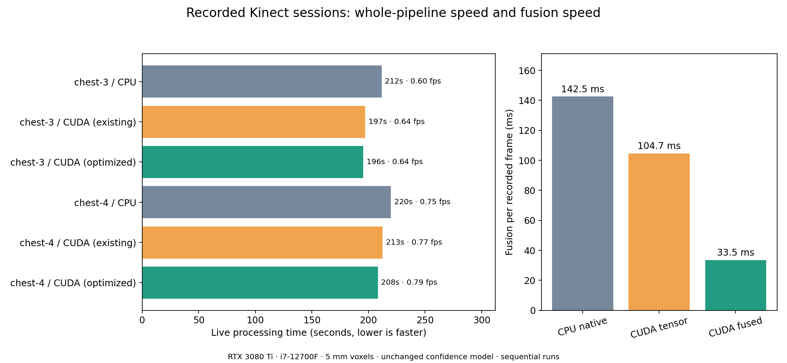

# Scanning performance on your recordings

Measured on the i7-12700F / RTX 3080 Ti using all frames and the saved 5 mm scan settings.

| Session | Backend | Live processing | Processing rate | Typical / p95 frame | Live accepted | Finish | Final accepted |
| --- | --- | ---: | ---: | ---: | ---: | ---: | ---: |
| chest-3 | CPU | 211.6s | 0.60 fps | 1.21s / 5.12s | 106/126 | 424.2s | 121 |
| chest-3 | CUDA (existing) | 197.0s | 0.64 fps | 1.12s / 4.56s | 106/126 | — | — |
| chest-3 | CUDA (optimized) | 195.5s | 0.64 fps | 1.05s / 5.02s | 106/126 | 357.9s | 121 |
| chest-4 | CPU | 219.8s | 0.75 fps | 0.96s / 3.82s | 133/164 | 267.8s | 162 |
| chest-4 | CUDA (existing) | 212.5s | 0.77 fps | 0.84s / 3.79s | 130/164 | — | — |
| chest-4 | CUDA (optimized) | 208.2s | 0.79 fps | 0.88s / 3.55s | 132/164 | 248.8s | 162 |

Processing FPS measures how quickly already captured views are processed. USB, network transfer and texture export are excluded. Automatic capture pacing, camera motion and tracking recovery also affect scanning speed. A frame with lost tracking can take much longer than a typical frame.

Full replays are single measurements per configuration; fusion has five warmed, synchronized measurements at each of six recorded views. CPU tracking/recovery timing varies. Finish can test different numbers of candidate links across backends; its timing difference cannot be attributed entirely to GPU fusion. These captures have no independent ground truth. Compare accepted frames and final geometry as well as speed.

The fused confidence update is numerically checked against CPU and CUDA references. It preserves depth, confidence and truncation gates. Final graph reconnection and pose refinement still run on CPU.

## Final surface comparison

Nearest-vertex distances compare two reconstructions of the same observations; they do not establish absolute accuracy or measure triangle interiors.

- chest-3: identical retained frame indices; vertex-distance RMS 0.326 mm, p95 0.384 mm, maximum 20.8 mm. Maximum camera-pose difference 8.2 mm / 0.310 degrees.
  Area-weighted triangle-surface RMS 0.145 mm; p95 0.159 mm; precision/completeness within 5 mm 99.993% / 99.970% (30,000 points per surface, fixed coordinates).
- chest-4: identical retained frame indices; vertex-distance RMS 0.077 mm, p95 0.029 mm, maximum 7.4 mm. Maximum camera-pose difference 0.1 mm / 0.001 degrees.
  Area-weighted triangle-surface RMS 0.047 mm; p95 0.020 mm; precision/completeness within 5 mm 100.000% / 100.000% (30,000 points per surface, fixed coordinates).

## Implementation and use

The new fused confidence-weighted CUDA update borrows Open3D GPU buffers directly and processes bounded batches. Recorded fusion improved from a median 104.7 ms to 33.5 ms versus existing CUDA, with unchanged confidence equations and depth gates. CPU execution retains its existing implementation.

Install the optional CUDA 12 dependency with `python -m pip install -r requirements-cuda-fusion.txt`. `KINECT_CUDA_FUSION=auto` uses it when available, `fused` requires it, and `tensor` selects the previous GPU implementation. Final validation passed 47 tests, including GPU parity, volume growth, rounding, compiler fallback and update-failure handling.

The local server was restarted from this worktree on port 8000 with CUDA tensor tracking, native CPU preparation and fused confidence integration. A six-frame HTTP scan built and exported a PLY successfully; initial scan settings were restored and the server is ready for a new scan.
